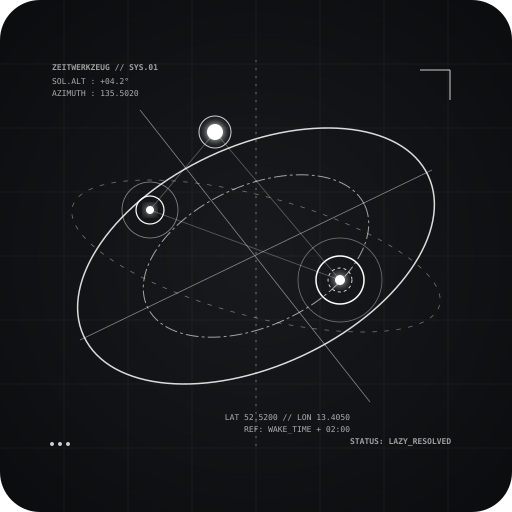

<p align="center">
  
</p>

<h1 align="center">
  Zeitwerkzeug
</h1>

<p align="center">
  <strong>Contextual Time &amp; Adaptive Scheduling for Python</strong>
</p>

<p align="center">
  
  
  
</p>

> ⏰ **Alpha project:** `zeitwerkzeug` is in early development.
> Expect breaking API changes before a  `1.0` release.

---

## Overview

**Zeitwerkzeug** — German for *“time tool”* — treats time not as a fixed stream of clock timestamps, but as a dynamic resource derived from:

- solar geometry,
- human circadian rhythms,
- environmental conditions,
- and contextual intent.

It is designed for:

- IoT,
- home automation,
- context-aware daemons,
- adaptive background jobs.

---

## Table of contents

- [Features](#features)
- [Installation](#installation)
- [Quick start](#quick-start)
- [Key concepts](#key-concepts)
  - [Schedules](#schedules-lazyschedule)
  - [Conditions](#conditions-conditionplugin)
  - [Persona profiles](#persona-profiles)
  - [Fail & retry policies](#fail--retry-policies)
  - [Execution loop](#execution-loop)
- [Persistence & state storage](#persistence--state-storage)
  - [Persistence quick start](#persistence-quick-start)
  - [Surviving restarts](#surviving-restarts-job-restore-pattern)
- [Weather integration](#weather-integration-open-meteo)
- [Full example: smart garden irrigation](#full-example-smart-garden-irrigation)
- [Development](#development)
- [Project structure](#project-structure)
- [License](#license)
- [Contributing](#contributing)
- [Acknowledgments](#acknowledgments)

---

## Features

- ☀️ **Solar geometry** — dawn, golden hour, dusk, and arbitrary solar altitude angles.
- 🧑‍💼 **Human personas** — wake/sleep rhythms, weekend schedule shifts, and proportional awake blocks.
- 🌦️ **Context-aware conditions** — real-time weather, sun altitude checks, local time windows, and logical combinators.
- 🔄 **Async execution loop** — drifting schedules that recalibrate over time and across midnight transitions.
- ⚡ **Lazy schedules** — fluent, chainable API for constructing complex triggers.
- 🛡️ **Retry & backoff** — configurable retry policies with interval and deadline constraints.
- 🌐 **Weather integration** — built-in Open-Meteo client with rate-limiting protection.
- 💾 **SQLite persistence** — execution history logging and safe restart recovery without pickle risks.

---

## Installation

Install the core package:

```bash
pip install zeitwerkzeug
```

For weather integrations using Open-Meteo:

```bash
pip install "zeitwerkzeug[weather]"
```

---

## Quick start

### Solar-powered personal assistant

```python
"""Zeitwerkzeug — Solar-powered personal assistant."""

import asyncio
import logging
from datetime import UTC, datetime, time, timedelta

from zeitwerkzeug import (
    ClearWeather,
    ExecutionLoop,
    FuzzyCron,
    Location,
    ScheduleBuilder,
    SolarEvent,
    SunAltitudeAbove,
    TimeWindow,
)

logging.basicConfig(level=logging.INFO)

# 1. Define your location
BERLIN = Location(lat=52.52, lon=13.405, timezone="Europe/Berlin")

# 2. Build schedules with the fluent API
schedule = ScheduleBuilder()

# Sunrise — open blinds, but only if the sun is actually up
# and it is a reasonable hour.
sunrise = (
    schedule.at(SolarEvent.SUNRISE, location=BERLIN)
    .require(
        SunAltitudeAbove(location=BERLIN, min_altitude=0.0),
        TimeWindow(
            start=time(6, 0),
            end=time(22, 0),
            tz="Europe/Berlin",
        ),
    )
    .on_fail(
        retry_interval=timedelta(minutes=5),
        max_attempts=3,
    )
)

# Golden hour — water plants, but only if the weather is clear.
golden_hour = (
    schedule.at(SolarEvent.GOLDEN_HOUR, location=BERLIN)
    .require(
        ClearWeather(
            lat=BERLIN.lat,
            lon=BERLIN.lon,
            max_cloud_cover=30,
        ),
    )
    .on_fail(
        retry_interval=timedelta(minutes=15),
        max_attempts=2,
    )
)

# Civil dusk — close blinds every evening.
dusk = schedule.at(SolarEvent.CIVIL_DUSK, location=BERLIN).on_fail(
    retry_interval=timedelta(minutes=10),
    max_attempts=5,
)


# 3. Define jobs
async def open_blinds(ctx):
    print(f"🌅 Opening blinds at {ctx.triggered_at.isoformat()}")


async def water_plants(ctx):
    print(f"🌱 Watering plants at {ctx.triggered_at.isoformat()}")


async def close_blinds(ctx):
    print(f"🌇 Closing blinds at {ctx.triggered_at.isoformat()}")


# 4. Register jobs
FuzzyCron.add_job(
    open_blinds,
    trigger=sunrise,
    name="open_blinds",
    pass_context=True,
)

FuzzyCron.add_job(
    water_plants,
    trigger=golden_hour,
    name="water_plants",
    pass_context=True,
)

FuzzyCron.add_job(
    close_blinds,
    trigger=dusk,
    name="close_blinds",
    pass_context=True,
)


# 5. Run the daemon
async def main():
    loop = ExecutionLoop(
        max_concurrency=4,
        default_job_timeout=timedelta(minutes=2),
        midnight_recalibration=True,
    )

    # Run for 5 minutes in this demo.
    # In production, usually use: await loop.run()
    await loop.run(until=datetime.now(UTC) + timedelta(minutes=5))

    print("\nExecution history:")
    for record in loop.history:
        print(f"  {record.job_name:20} | {record.status:15} | attempt={record.attempt}")


if __name__ == "__main__":
    asyncio.run(main())
```

---

## Solar event with custom angle

```python
from zeitwerkzeug import Location, schedule
from zeitwerkzeug.astro import SolarAngle

location = Location(
    lat=34.6937,
    lon=135.5020,
    timezone="Asia/Tokyo",
)

# Custom solar angle: golden hour (-4°) on the rising branch
golden_hour = SolarAngle(
    altitude=-4.0,
    rising=True,
    name="golden_hour",
)

trigger = schedule.at(golden_hour, location=location)
```

---

## Human persona & time windows

```python
from datetime import time, timedelta

from zeitwerkzeug import StandardWorker, TimeWindow, schedule

persona = StandardWorker(tz="Asia/Tokyo")

# Schedule: 2 hours after waking, within a time window
trigger = schedule.at(lambda t: persona.wake_datetime(t) + timedelta(hours=2)).require(
    TimeWindow(
        start=time(6, 0),
        end=time(9, 0),
        tz="Asia/Tokyo",
    )
)
```

---

## Logical condition combinators

```python
from datetime import time

from zeitwerkzeug import Location, schedule
from zeitwerkzeug.context import All, Not, SunAltitudeAbove, TimeWindow

location = Location(
    lat=34.6937,
    lon=135.5020,
    timezone="Asia/Tokyo",
)

trigger = schedule.at("sunset", location=location).require(
    All(
        (
            SunAltitudeAbove(
                location=location,
                min_altitude=-6.0,
            ),
            Not(
                TimeWindow(
                    start=time(0, 0),
                    end=time(5, 0),
                    tz="Asia/Tokyo",
                )
            ),
        )
    )
)
```

---

## Async job with retry policy

```python
from datetime import timedelta

from zeitwerkzeug import ExecutionLoop, FuzzyCron, Location, schedule


async def fetch_weather(ctx):
    print(f"🌤️ Fetching weather at {ctx.triggered_at}")


location = Location(
    lat=34.6937,
    lon=135.5020,
    timezone="Asia/Tokyo",
)

trigger = schedule.at("sunrise", location=location).on_fail(
    retry_interval=timedelta(minutes=5),
    max_attempts=3,
)

cron = FuzzyCron()
cron.register(
    fetch_weather,
    trigger,
    name="weather-fetch",
)

loop = ExecutionLoop(
    registry=cron,
    default_job_timeout=timedelta(seconds=30),
    max_concurrency=5,
)

# await loop.run()
```

---

## Key concepts

### Schedules (`LazySchedule`)

A schedule is a lazily resolved trigger. Build one with the `schedule` builder:

```python
schedule.at(target, location=None, tz=None)
```

Supported targets:

| Type         | Example                                             |
| ------------ | --------------------------------------------------- |
| `SolarEvent` | `"sunrise"`, `"sunset"`, `"golden_hour"`           |
| `SolarAngle` | `SolarAngle(altitude=-4.0, rising=True)`           |
| `datetime`   | `datetime(2026, 1, 1, 12, 0, tzinfo=UTC)`          |
| `time`       | `time(14, 30)` — daily recurring                   |
| `Callable`   | `lambda t: t + timedelta(hours=1)`                 |

Chaining methods:

- `.require(*conditions)` — add required conditions.
- `.on_fail(retry_interval=..., max_attempts=..., limit=...)` — attach a retry policy.

---

### Conditions (`ConditionPlugin`)

Conditions are evaluated immediately before job execution.

Built-in conditions include:

| Condition                                      | Description                                      |
| ---------------------------------------------- | ------------------------------------------------ |
| `SunAltitudeAbove(location, min_altitude)`     | Sun altitude is greater than or equal to threshold. |
| `TimeWindow(start, end, tz)`                   | Time is within a local window.                    |
| `ClearWeather(lat, lon, max_cloud_cover)`      | Cloud cover is below threshold. Requires `[weather]` extra. |
| `All(*conditions)`                             | Logical AND.                                      |
| `Any(*conditions)`                             | Logical OR.                                       |
| `Not(condition)`                               | Logical NOT.                                      |

---

### Persona profiles

Model human daily rhythms with wake/sleep anchors.

```python
from datetime import time, timedelta

from zeitwerkzeug.personas import NightShift, PersonaProfile, StandardWorker

# Built-in profiles
worker = StandardWorker(
    wake="06:30",
    sleep="22:30",
    tz="Asia/Tokyo",
)

night = NightShift(
    wake="13:00",
    sleep="05:00",
    tz="Asia/Tokyo",
)

# Custom profile
custom = PersonaProfile(
    wake=time(8, 0),
    sleep=time(0, 0),
    tz="Asia/Tokyo",
    weekend_wake_shift=timedelta(hours=2),
    weekend_sleep_shift=timedelta(hours=2),
)
```

Available methods:

- `wake_datetime(reference)` — wake time for a reference date.
- `sleep_datetime(reference)` — sleep time, moving to the next day if needed.
- `awake_block(reference)` — full awake window.
- `proportional_block(reference, start_frac, end_frac)` — fractional window.

---

### Fail & retry policies

Attach a retry policy to a schedule:

```python
from datetime import timedelta

schedule.at("sunset", location=location).on_fail(
    retry_interval=timedelta(minutes=5),
    max_attempts=3,
    limit=timedelta(hours=2),
)
```

`limit` can also be a `datetime`, `time`, `timedelta`, or supported solar target, depending on the API surface available in your version.

---

### Execution loop

The `ExecutionLoop` runs the scheduler with these capabilities:

- drifting schedules — `resolve_after()` recalculates on each run,
- midnight recalibration — re-evaluates schedules daily per timezone,
- concurrency control — semaphore-based limit,
- history — retains execution records,
- graceful shutdown via `stop()`.

```python
from datetime import UTC, datetime, timedelta

from zeitwerkzeug import ExecutionLoop, FuzzyCron

loop = ExecutionLoop(
    registry=FuzzyCron(),
    max_concurrency=32,
    default_job_timeout=timedelta(minutes=5),
    default_condition_timeout=timedelta(seconds=30),
    history_limit=1000,
)

# Run until a deadline
await loop.run(until=datetime(2026, 1, 1, tzinfo=UTC))
```

---

## Persistence & state storage

`zeitwerkzeug` includes built-in SQLite persistence for:

- execution history logging,
- job metadata storage,
- restart recovery,
- avoiding unsafe serialization formats such as pickle.

---

## Persistence quick start

Replace `ExecutionLoop` with `PersistentExecutionLoop` and initialize the database before running:

```python
import asyncio
from datetime import timedelta

from zeitwerkzeug import Location, ScheduleBuilder, SolarEvent
from zeitwerkzeug.persistence import PersistentExecutionLoop

BERLIN = Location(
    lat=52.52,
    lon=13.405,
    timezone="Europe/Berlin",
)


async def open_blinds(ctx):
    print(f"🌅 Opening blinds at {ctx.triggered_at}")


async def main():
    loop = PersistentExecutionLoop(
        db_path="scheduler.db",
        max_concurrency=4,
        default_job_timeout=timedelta(minutes=2),
        midnight_recalibration=True,
    )

    # Create database tables and prepare history tracking.
    await loop.init()

    schedule = ScheduleBuilder()
    sunrise = schedule.at(SolarEvent.SUNRISE, location=BERLIN)

    loop.registry.add_job(
        open_blinds,
        trigger=sunrise,
        name="open_blinds",
    )

    await loop.run()


if __name__ == "__main__":
    asyncio.run(main())
```

---

## Surviving restarts: job restore pattern

Re-register jobs dynamically on boot by supplying a loader function that rebuilds the callable and trigger.

```python
import asyncio
import importlib

from zeitwerkzeug import Location, ScheduleBuilder, SolarEvent
from zeitwerkzeug.persistence import JobRecord, PersistentExecutionLoop

BERLIN = Location(
    lat=52.52,
    lon=13.405,
    timezone="Europe/Berlin",
)


async def job_loader(record: JobRecord):
    module = importlib.import_module(record.module)
    func = getattr(module, record.qualname)

    # Reconstruct the trigger context.
    schedule = ScheduleBuilder()
    trigger = schedule.at(SolarEvent.SUNRISE, location=BERLIN)

    return func, trigger


async def main():
    loop = PersistentExecutionLoop(db_path="scheduler.db")

    await loop.init()

    # Restore job registrations from the database.
    await loop.registry.restore_jobs(job_loader)

    await loop.run()


if __name__ == "__main__":
    asyncio.run(main())
```

---

## Weather integration: Open-Meteo

The `ClearWeather` condition uses the [Open-Meteo API](https://open-meteo.com/).

- **Free tier** — rate-limited, with safety margins.
- **Commercial tier** — pass your `api_key` for higher limits.

```python
from zeitwerkzeug.integrations.weather import ClearWeather

condition = ClearWeather(
    lat=34.6937,
    lon=135.5020,
    max_cloud_cover=30,
    api_key="your_commercial_key",  # optional
)
```

License & attribution:

> Weather data provided by [Open-Meteo](https://open-meteo.com/).
> Used under the CC BY 4.0 license.

---

## Full example: smart garden irrigation

```python
#!/usr/bin/env python3
"""Water the garden at sunrise if it is clear and the sun is high enough."""

import asyncio
from datetime import timedelta

from zeitwerkzeug import (
    ExecutionLoop,
    FuzzyCron,
    Location,
    SunAltitudeAbove,
    schedule,
)
from zeitwerkzeug.integrations.weather import ClearWeather

# Osaka, Japan
LOCATION = Location(
    lat=34.6937,
    lon=135.5020,
    timezone="Asia/Tokyo",
)

MAX_CLOUD_COVER = 40


def water_plants(ctx):
    print(f"💧 Watering garden at {ctx.triggered_at} (attempt {ctx.attempt})")


async def main():
    trigger = (
        schedule.at("sunrise", location=LOCATION)
        .require(
            ClearWeather(
                lat=LOCATION.lat,
                lon=LOCATION.lon,
                max_cloud_cover=MAX_CLOUD_COVER,
            ),
            SunAltitudeAbove(
                location=LOCATION,
                min_altitude=-6.0,
            ),
        )
        .on_fail(
            retry_interval=timedelta(minutes=15),
            max_attempts=3,
            limit=timedelta(hours=2),
        )
    )

    cron = FuzzyCron()
    cron.register(
        water_plants,
        trigger,
        name="garden-irrigation",
    )

    loop = ExecutionLoop(
        registry=cron,
        default_job_timeout=timedelta(seconds=30),
        max_concurrency=2,
    )

    print("🌱 Garden irrigation daemon started")
    await loop.run()


if __name__ == "__main__":
    asyncio.run(main())
```

---

## Development

### Setup

This project uses [Task](https://taskfile.dev).

```bash
task install
task lint
task typecheck
task test
```

---

## Project structure

```text
src/zeitwerkzeug/
├── astro/          # Solar geometry engine
├── context/        # Scheduling primitives and conditions
├── daemon/         # Async execution loop and job registry
├── integrations/   # Third-party integrations, such as weather
├── persistence     # For persiatence with sqlite via aiosqlite
├── personas/       # Human rhythm profiles and parser
├── exceptions.py   # Central error hierarchy
├── interfaces.py   # Protocol definitions
└── __init__.py     # Public API
```

---

## License

MIT License.

See [`LICENSE`](LICENSE) for details.

---

## Contributing

Contributions are welcome! Please:

1. Open an issue for bugs or feature requests.
2. Follow the existing code style, enforced by `ruff` and `mypy`.
3. Include tests for new functionality.
4. Update documentation as needed.

---

## Acknowledgments

- Solar calculations are inspired by NOAA and Meeus algorithms.
- Weather data is provided by [Open-Meteo](https://open-meteo.com/).
- Built for Python 3.11+ with `asyncio` and modern type hints.