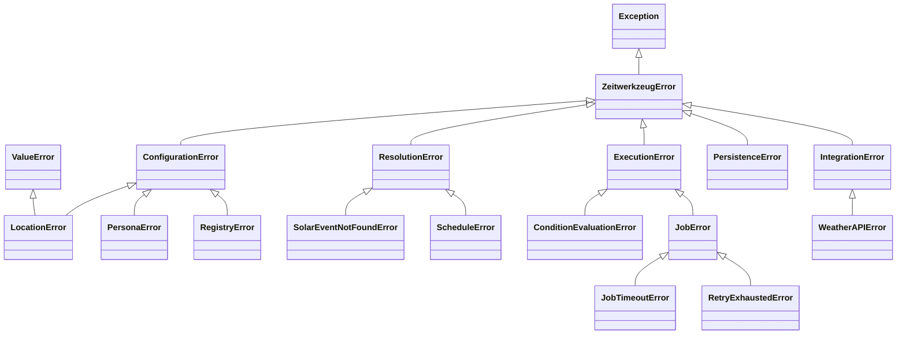

# Exceptions API

!!! quote "In one sentence"
    Every error inherits from `ZeitwerkzeugError` and carries structured context you can log or branch on.

## The hierarchy at a glance



## Quick reference

| Exception | Category | Raised when | Key attributes |
| --- | --- | --- | --- |
| `ZeitwerkzeugError` | base | any library error | — |
| `ConfigurationError` | config | invalid setup, before running | — |
| `LocationError` | config | bad lat/lon/timezone | `lat`, `lon` |
| `PersonaError` | config | bad profile or parse | `profile` |
| `RegistryError` | config | duplicate/invalid job | `job_name` |
| `ResolutionError` | resolve | trigger can't become a time | — |
| `SolarEventNotFoundError` | resolve | event never occurs (polar night) | `event`, `location`, `when` |
| `ScheduleError` | resolve | lazy schedule won't resolve | `schedule` |
| `ExecutionError` | runtime | failure while running | — |
| `ConditionEvaluationError` | runtime | a condition plugin raises | `condition` |
| `JobError` | runtime | a job is invalid or raises | `job_name` |
| `JobTimeoutError` | runtime | job exceeded timeout | `job_name`, `timeout` |
| `RetryExhaustedError` | runtime | retries exhausted | `job_name`, `attempts` |
| `IntegrationError` | external | third-party service failed | — |
| `WeatherAPIError` | external | Open-Meteo returned an error | `status_code`, `endpoint` |
| `PersistenceError` | storage | SQLite read/write failed | `db_path` |

## Catching errors

Catch the base class to handle everything, or a category to be specific:

```python
from zeitwerkzeug import (
    ExecutionError,
    RetryExhaustedError,
    ZeitwerkzeugError,
)

try:
    await loop.run()
except RetryExhaustedError as exc:  # most specific first
    log.warning("gave up on %s after %d tries", exc.job_name, exc.attempts)
except ExecutionError as exc:  # whole runtime category
    log.error("runtime failure: %s", exc)
except ZeitwerkzeugError:  # everything else
    log.exception("unexpected scheduler error")
```

!!! tip "Errors are data"
    Because each exception stores attributes, your log lines are informative
    automatically: `str(RetryExhaustedError("failed", job_name="water", attempts=3))`
    → `failed (job='water') (attempts=3)`.

## Preserving tracebacks

When wrapping a lower-level failure, chain with `from` so the original
traceback survives:

```python
try:
    ok = await condition.evaluate(context)
except Exception as cause:
    raise ConditionEvaluationError("weather check failed", condition="ClearWeather") from cause
```

## Full reference

The complete, auto-generated documentation for every class — including all
attributes and examples — is rendered straight from the source docstrings:

::: zeitwerkzeug.exceptions
    options:
      show_root_heading: false
      heading_level: 3
      show_source: true
