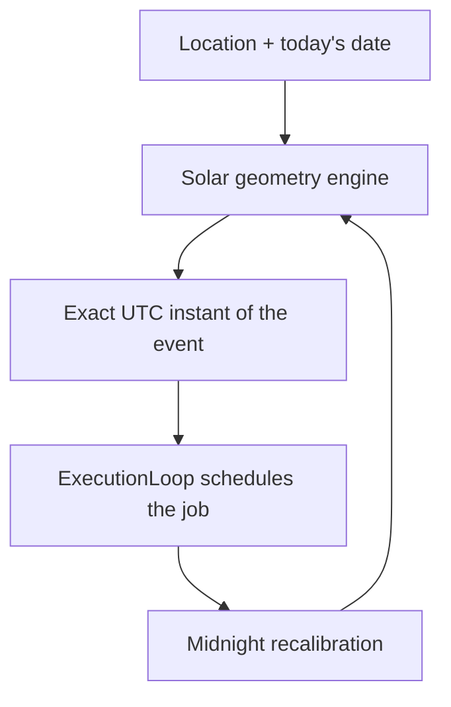

# Solar time

!!! quote "In one sentence"
    A schedule is a *promise about the sky*, not a fixed clock time.

## The idea

`cron` is an alarm clock: it rings at 06:00 whether the sun is up or not.
Zeitwerkzeug is a gardener who looks outside before watering the plants.

Solar events are **computed for your exact location, every day**, using a pure
solar-geometry engine (NOAA / Meeus style math) — no internet connection required.

## Solar events you can use

| Target | Meaning |
| --- | --- |
| `SolarEvent.SUNRISE` / `"sunrise"` | Sun crosses the horizon going up |
| `SolarEvent.SUNSET` / `"sunset"` | Sun crosses the horizon going down |
| `SolarEvent.GOLDEN_HOUR` / `"golden_hour"` | Soft, low light — before sunset |
| `SolarEvent.CIVIL_DUSK` | Sun at −6°, street-light time |
| `SolarAngle(altitude, rising)` | Any custom angle you invent |

## Your first solar trigger

```python
from zeitwerkzeug import Location, SolarEvent, schedule

OSAKA = Location(lat=34.6937, lon=135.5020, timezone="Asia/Tokyo")

trigger = schedule.at(SolarEvent.GOLDEN_HOUR, location=OSAKA)  # (1)
```

1. Resolves to *today's* golden hour in Osaka — and automatically re-resolves tomorrow.

!!! tip "Strings work too"
    `schedule.at("sunrise", location=OSAKA)` is identical to using the enum.
    Strings are resolved lazily, so typos fail early with a clear error.

## Custom angles

Need "sun 10° above the horizon, on the rising side"? Use `SolarAngle`:

```python
from zeitwerkzeug.astro import SolarAngle

morning_ten = SolarAngle(altitude=10.0, rising=True, name="morning-ten")
trigger = schedule.at(morning_ten, location=OSAKA)
```

## Why it stays accurate forever



The loop **recalibrates at midnight per timezone**, so daylight-saving changes,
latitude seasons and longitude drift never accumulate error.

## Try it yourself

??? example "Full runnable example"
    ```python
    import asyncio
    from datetime import timedelta

    from zeitwerkzeug import ExecutionLoop, FuzzyCron, Location, SolarEvent, schedule

    OSAKA = Location(lat=34.6937, lon=135.5020, timezone="Asia/Tokyo")


    async def water_plants(ctx):
        print(f"💧 Watering at {ctx.triggered_at}")


    async def main():
        trigger = schedule.at(SolarEvent.SUNRISE, location=OSAKA).on_fail(
            retry_interval=timedelta(minutes=15), max_attempts=3
        )

        cron = FuzzyCron()
        cron.register(water_plants, trigger, name="water-plants")

        loop = ExecutionLoop(registry=cron)
        await loop.run()


    asyncio.run(main())
    ```

## Where to go next

-   [Conditions →](context.md) gate your solar triggers with weather and time windows.
-   [Personas →](personas.md) mix solar time with human sleep/wake rhythms.
