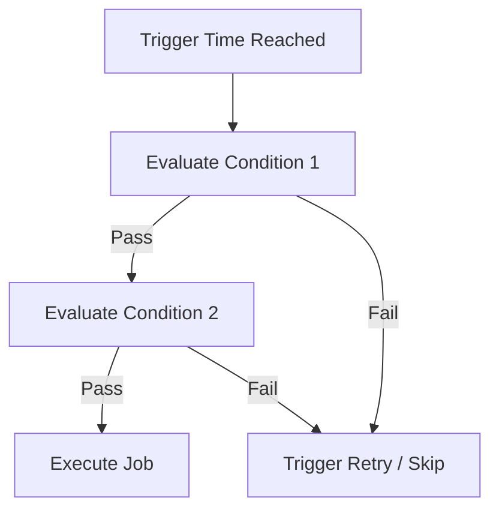

# Conditions & Context

!!! quote "In one sentence"
    A trigger picks the *moment*. A condition makes sure it's still a *good idea*.

## The idea

`cron` is a factory whistle: it blows at 12:00 whether there's a power outage or not.
Zeitwerkzeug is a bouncer at a club. The schedule gets the job to the door, but the **conditions** decide if it actually gets inside.

Conditions evaluate exactly when the trigger fires. If they fail, the job is skipped or passed to the retry policy.

## Built-in conditions

| Condition | What it checks |
| --- | --- |
| `TimeWindow` | Is the current local time inside a specific range? |
| `SunAltitudeAbove` | Is the sun higher than a specific angle? |
| `ClearWeather` | Is the cloud cover below a certain percentage? (Requires `[weather]`) |

## Gating a trigger

Use `.require()` to attach conditions to a schedule. You can pass one, or many.

```python
from datetime import time
from zeitwerkzeug import Location, TimeWindow, schedule
from zeitwerkzeug.integrations.weather import ClearWeather

BERLIN = Location(lat=52.52, lon=13.405, timezone="Europe/Berlin")

trigger = schedule.at("14:00", tz="Europe/Berlin").require(
    TimeWindow(start=time(12, 0), end=time(18, 0), tz="Europe/Berlin"),  # (1)
    ClearWeather(lat=BERLIN.lat, lon=BERLIN.lon, max_cloud_cover=30),  # (2)
)
```

1. Ensures we only act during daylight afternoon hours (e.g., in case of timezone bugs).
2. Checks Open-Meteo to ensure the sky is mostly clear.

!!! warning "Weather API limits"
    `ClearWeather` respects free-tier Open-Meteo rate limits automatically. For high-frequency polling, pass an `api_key`.

## Logical combinators

Sometimes "all" isn't enough. You need complex logic. Use `All`, `Any`, and `Not` to build complex boolean trees.

```python
from zeitwerkzeug.context import All, Any, Not

condition = Any(
    All(
        SunAltitudeAbove(location=BERLIN, min_altitude=10.0),
        ClearWeather(lat=BERLIN.lat, lon=BERLIN.lon, max_cloud_cover=20),
    ),
    Not(
        TimeWindow(start=time(0, 0), end=time(6, 0), tz="Europe/Berlin")
    ),  # Never run between midnight and 6 AM
)
```

## How evaluation works



## Try it yourself

??? example "Smart Garden Irrigation"
    Only water the plants at sunrise, but *only* if it isn't already raining.
    ```python
    import asyncio
    from datetime import timedelta
    from zeitwerkzeug import ExecutionLoop, FuzzyCron, Location, schedule
    from zeitwerkzeug.integrations.weather import ClearWeather


    async def water_garden(ctx):
        print("💧 Watering the garden!")


    async def main():
        trigger = (
            schedule.at("sunrise", location=Location(34.69, 135.50, "Asia/Tokyo"))
            .require(ClearWeather(lat=34.69, lon=135.50, max_cloud_cover=40))
            .on_fail(retry_interval=timedelta(minutes=30), max_attempts=2)
        )

        cron = FuzzyCron()
        cron.register(water_garden, trigger, name="irrigation")

        loop = ExecutionLoop(registry=cron)
        await loop.run()


    asyncio.run(main())
    ```

## Where to go next

-   [Solar time →](astro.md) if you want to trigger based on the sky.
-   [Personas →](personas.md) if you want to trigger based on human routines.
