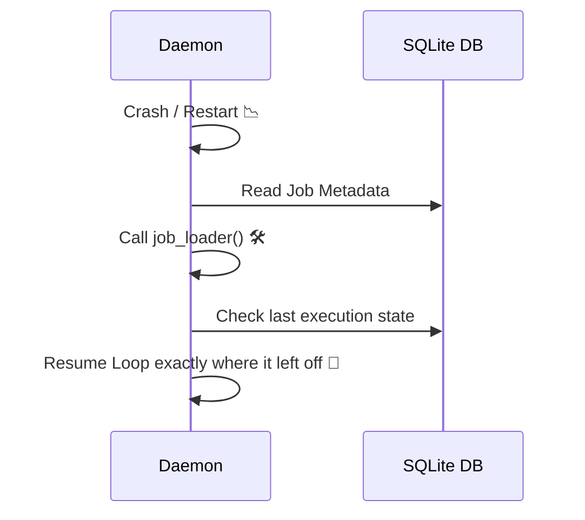

# Persistence & Restarts

!!! quote "In one sentence"
    Memory is volatile. Your scheduler should survive a reboot without losing its mind.

## The idea

Standard async loops live in RAM. If the server crashes, the Raspberry Pi loses power, or the Docker container restarts, your daemon forgets what it was doing. Did it run the 09:00 job? Did it fail and wait for a retry?

`zeitwerkzeug` includes a **SQLite-backed persistence layer** that logs execution history and safely restores jobs when the process comes back online—without using unsafe serialization formats like `pickle`.

## The `PersistentExecutionLoop`

To enable persistence, swap your standard loop for the persistent one.

```python
from zeitwerkzeug.persistence import PersistentExecutionLoop

loop = PersistentExecutionLoop(
    db_path="scheduler.db",  # (1)
    max_concurrency=4,
    default_job_timeout=timedelta(minutes=2),
    midnight_recalibration=True,
)

await loop.init()  # (2)
```

1. Creates a lightweight SQLite file. `aiosqlite` is used under the hood so it never blocks the async loop.
2. `init()` must be called before `run()` to create the database tables.

## Surviving Restarts: The Job Loader

Python functions cannot be safely saved to a database (using `pickle` is a massive security risk).
Instead, Zeitwerkzeug saves the **job's metadata** (name, module, last run state). When the app reboots, you provide a `job_loader` to reconstruct the function and trigger.

```python
import importlib
from zeitwerkzeug.persistence import JobRecord


async def my_job_loader(record: JobRecord):
    # 1. Re-import the module dynamically
    module = importlib.import_module(record.module)
    func = getattr(module, record.qualname)

    # 2. Rebuild the trigger (you define the logic here)
    trigger = schedule.at("sunrise", location=BERLIN)

    return func, trigger
```

## The Reboot Flow



## Try it yourself

??? example "Full Persistent Daemon"
    ```python
    import asyncio
    from datetime import timedelta
    from zeitwerkzeug import Location, ScheduleBuilder, SolarEvent
    from zeitwerkzeug.persistence import PersistentExecutionLoop

    BERLIN = Location(lat=52.52, lon=13.405, timezone="Europe/Berlin")


    async def open_blinds(ctx):
        print(f"🌅 Opening blinds at {ctx.triggered_at}")


    async def main():
        # 1. Initialize the persistent loop
        loop = PersistentExecutionLoop(db_path="scheduler.db")
        await loop.init()

        # 2. Build the schedule
        schedule = ScheduleBuilder()
        sunrise = schedule.at(SolarEvent.SUNRISE, location=BERLIN)

        # 3. Register normally
        loop.registry.add_job(open_blinds, trigger=sunrise, name="open_blinds")

        # 4. Run forever. If it crashes, the history is safe in the DB.
        await loop.run()


    if __name__ == "__main__":
        asyncio.run(main())
    ```

## Why not Redis or Postgres?

`zeitwerkzeug` is designed to be a lightweight, zero-config daemon for IoT and personal automation. SQLite requires zero infrastructure setup, runs perfectly on a Raspberry Pi, and is fully supported via async `aiosqlite`.

## Where to go next

-   [Execution Loop →](../api/daemon.md) in the API reference to see all persistence configuration options.
-   [Conditions →](context.md) to learn what to do when jobs fail and need to be retried.
