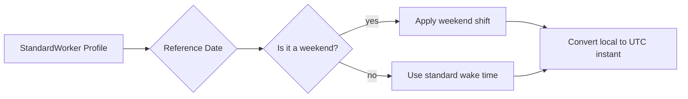

# Personas (Human Time)

!!! quote "In one sentence"
    Time is subjective. 07:00 is a wake-up time for a day shift, but the middle of the night for a night shift.

## The idea

A fixed timestamp like `time(9, 0)` assumes everyone lives the same way. But humans don't.
**Personas** allow you to anchor schedules to a user's biological rhythm rather than the wall clock.

Zeitwerkzeug translates concepts like "wake up" or "2 hours after waking" into precise UTC datetimes, adjusting automatically for weekends or night shifts.

## Built-in profiles

| Persona | Typical rhythm |
| --- | --- |
| `StandardWorker` | Wakes ~06:30, sleeps ~22:30, sleeps in on weekends |
| `NightShift` | Wakes ~13:00, sleeps ~05:00 |
| `PersonaProfile` | Custom times, custom weekend shifts |

## Anchoring to a wake-up time

Instead of scheduling for `08:00`, schedule for "2 hours after wake up".

```python
from datetime import time, timedelta
from zeitwerkzeug import schedule
from zeitwerkzeug.personas import StandardWorker

worker = StandardWorker(wake="06:30", sleep="22:30", tz="Europe/Berlin")

trigger = schedule.at(
    lambda t: worker.wake_datetime(t) + timedelta(hours=2)  # (1)
).require(
    # Make sure it falls within standard working hours
    TimeWindow(start=time(8, 0), end=time(10, 0), tz="Europe/Berlin")
)
```

1. `wake_datetime(t)` calculates the exact wake-up time for the day of `t`, automatically adding weekend shifts if configured.

## Proportional time blocks

What does "late afternoon" mean? It depends on when the sun sets or when the user goes to sleep.
You can map fractions of an awake day to exact times.

```python
# Find the start of the "late afternoon" block
# (0.75 = 75% of the way through their awake day)
block = worker.proportional_block(reference_time, start_frac=0.75, end_frac=1.0)
```

## Parsing human intent

Zeitwerkzeug includes a `PersonaParser` that turns vague strings into time blocks.

```python
from zeitwerkzeug.personas import PersonaParser, StandardWorker

parser = PersonaParser(StandardWorker())

# "first thing in the morning" -> Resolves to 30 mins after wake time
trigger_time = parser.parse("first thing in the morning")
```

## How a persona maps to UTC



## Try it yourself

??? example "Night Shift Medication Reminder"
    Remind a night-shift worker to take their vitamin D "first thing in the morning" (which for them is 14:00).
    ```python
    import asyncio
    from datetime import timedelta
    from zeitwerkzeug import ExecutionLoop, FuzzyCron, schedule
    from zeitwerkzeug.personas import NightShift

    nurse = NightShift(wake="13:00", sleep="05:00", tz="Asia/Tokyo")


    async def take_vitamin_d(ctx):
        print("💊 Taking Vitamin D!")


    async def main():
        # 30 minutes after waking up
        trigger = schedule.at(lambda t: nurse.wake_datetime(t) + timedelta(minutes=30))

        cron = FuzzyCron()
        cron.register(take_vitamin_d, trigger, name="vitamins")

        loop = ExecutionLoop(registry=cron)
        await loop.run()


    asyncio.run(main())
    ```

## Where to go next

-   [Solar time →](astro.md) if you want to sync human rhythms with the actual sun.
-   [Persistence →](persistence.md) to save persona states across reboots.
