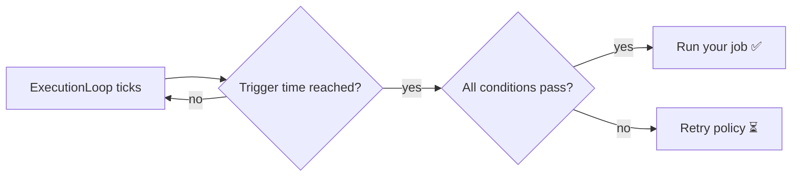

## What is this?

Most schedulers ask **"what time is it?"** — Zeitwerkzeug asks
**"what is happening right now?"** Is the sun up? Is it raining? Is the user asleep?

It runs your async jobs when the *context* is right, not when a fixed clock says so.

## See it in 30 seconds

```python
from datetime import timedelta

from zeitwerkzeug import Location, SolarEvent, SunAltitudeAbove, schedule

BERLIN = Location(lat=52.52, lon=13.405, timezone="Europe/Berlin")

trigger = (
    schedule.at(SolarEvent.SUNRISE, location=BERLIN)  # (1)
    .require(SunAltitudeAbove(location=BERLIN, min_altitude=0.0))  # (2)
    .on_fail(retry_interval=timedelta(minutes=5), max_attempts=3)  # (3)
)
```

1. **When** — fire at sunrise in Berlin. The exact instant is recomputed every day.
2. **Only if** — the sun is *actually* above the horizon when the job is about to run.
3. **If it fails** — retry every 5 minutes, up to 3 times.

## How a job gets executed



## cron vs Zeitwerkzeug

| Question | `cron` | Zeitwerkzeug |
| --- | --- | --- |
| Runs at a fixed clock time? | ✅ always | only as a fallback |
| Knows when the sun rises? | ❌ | ✅ computed per location, daily |
| Skips the job when it rains? | ❌ | ✅ with `ClearWeather` |
| Respects human sleep hours? | ❌ | ✅ with personas |
| Retries with backoff? | ❌ | ✅ with `.on_fail(...)` |

## Where to go next

<div class="grid cards" markdown>

-   **☀️ Solar time**

    ---

    Sunrise, golden hour, dusk — schedules that follow the sky, not the clock.

    [Learn solar time →](concepts/astro.md)

-   **🌦️ Conditions**

    ---

    Weather checks, time windows, and logical combinators (`All`, `Any`, `Not`).

    [Learn conditions →](concepts/context.md)

-   **😴 Personas**

    ---

    Model human rhythms: wake, sleep, weekends and night shifts.

    [Learn personas →](concepts/personas.md)

-   **💾 Persistence**

    ---

    Survive restarts with SQLite-backed history and job restore.

    [Learn persistence →](concepts/persistence.md)

</div>
